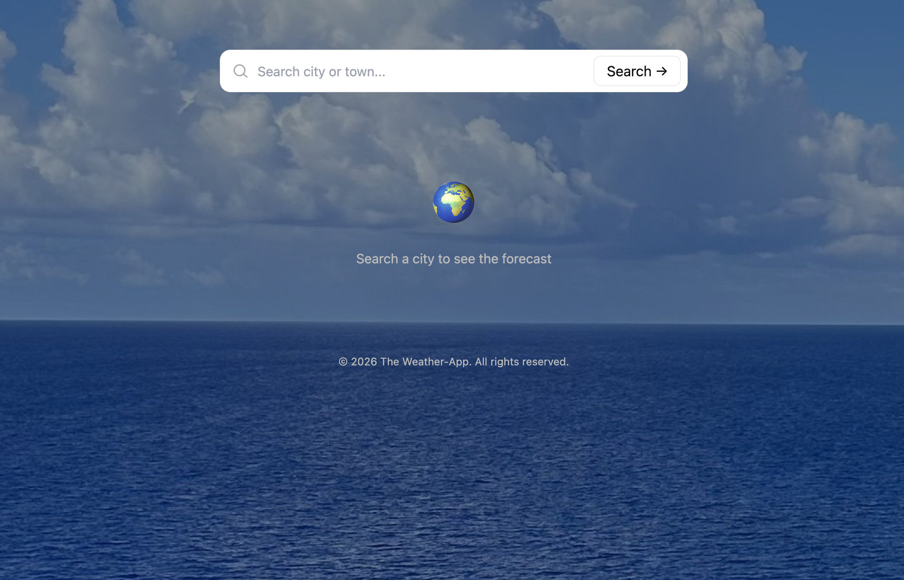
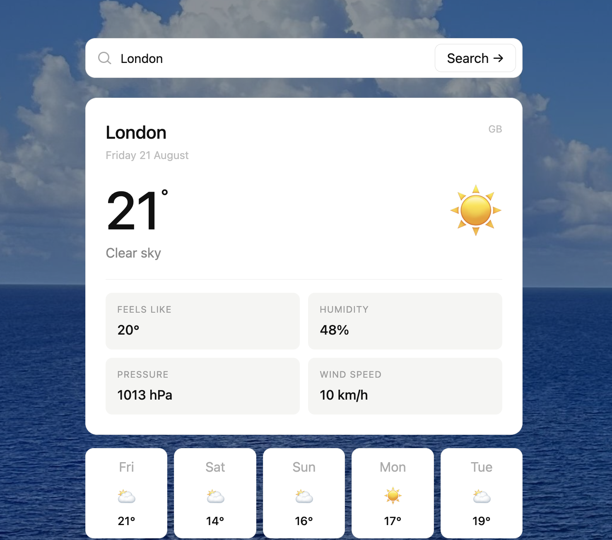

```markdown

# Weather-App

A responsive weather application built with React that retrieves and displays weather information for searched locations.

## Overview

Weather-App is a frontend web application that allows users to search for a location and view the current weather information.

The project was created to demonstrate React development, API integration, responsive UI design and asynchronous data handling.

## Features

- Search for locations
- Current weather information
- Temperature display 
- Weather conditions
- Weather icons
- Responsive interface
- Loading states
- Error handling
- Weather API integration
- Dynamic weather background

## Technologies

- React
- JavaScript
- Vite
- Tailwind CSS
- Axios
- Weather API

## Project Structure

```text
Weather-App/
├── src/
│   ├── assets/
│   ├── components/
│   ├── pages/
│   ├── App.jsx
│   ├── main.jsx
│   └── index.css
│
├── public/
├── package.json
└── README.md

API Integration:

The application retrieves weather information from an external weather API.

API credentials are stored using environment variables and are not commited to GitHub.

Deployment:

The application is deployed using Netlify.

Live Application:

https://pied-weather.netlify.app

Screenshots:




What I Learned:

This project helped me develop experience with:

• React components
• React state management
• API requests
• Asynchronous JavaScript
• Environment variables
• Error handling
• Responsive design
• Dynamic UI updates
• Git and GitHub
• Netlify deployment

Future Improvements:

• Extended weather forecasts
• Geolocation
• Hourly forecast
• Multiple saved locations
• Weather animations
• Dark / light themes

Author

Morenike Oyenuga

GitHub: https://github.com/morenike-dev

LinkedIn: https://www.linkedin.com/in/morenike-oyenuga-8a9b7a145
